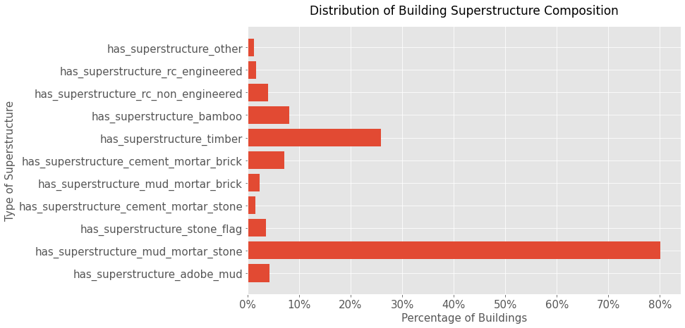
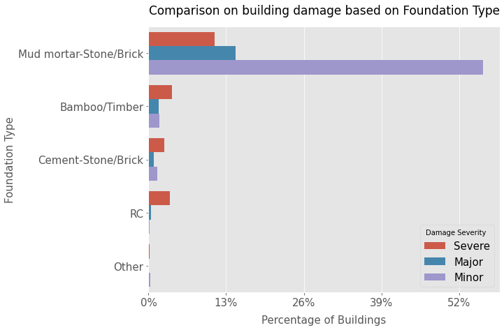
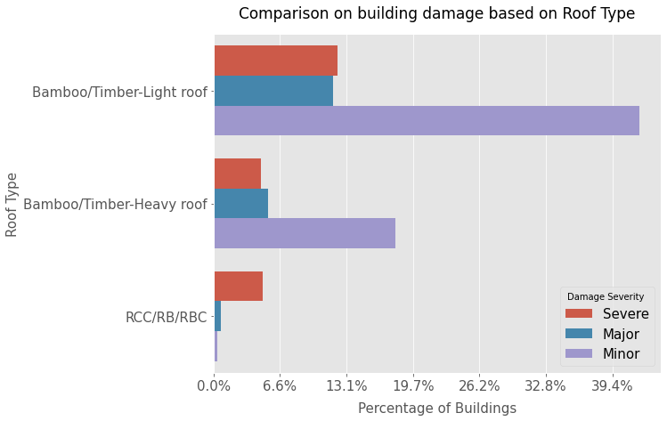
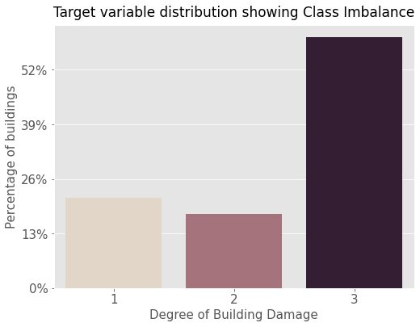

# Predicting Structural Damage from an Earthquake
**-Lhamu Tsering**

## Repository Structure

To navigate the repository better here is a table of its contents:

* **images** - Visualizations saved in the EDA and Modeling process
* **models** - Notebooks used to run model trial iterations
* **pre_model** - Contains data loading notebook, data cleaning notebooks and EDA notebooks
* **src/nb_modules** - Contain .py files
* **.gitignore** - list of hidden files to ignore in the versioning processs
* **capstone_presentation.pdf** - Presentation slide deck pdf 
* **README.md** - Readme file contains summary of the project process
* **predicting_building_damage.ipynb** - Final notebook showing a walkthrough of the data science process for this project.
* **data_dict.md** - Data dictionary of features in the datasets.

## Overview

There is a common saying among geologists that earthquakes don’t kill people, buildings kill people. An earthquake occurs with the movement of the earth’s surface. The ground shaking is a result of the sudden release of energy in the earth’s lithosphere as the tectonic plates move against each other [source](https://www.usgs.gov/faqs/what-earthquake-and-what-causes-them-happen?qt-news_science_products=0#qt-news_science_products). The Nepal 2015 earthquake was of 7.8 mag, which caused a lot of destruction and damage. After the earthquake, a survey of the damage was taken, considering individuals affected, buildings damaged and the households affected. The raw [data](https://eq2015.npc.gov.np/#/download) from this survey is used to create machine learning models that will predict building damage severity. 

## Business Problem

9000 people were killed in the 2015 7.8 mag earthquake in Nepal. Over 600,000 buildings were destroyed and the cost of building damages were estimated to be around $5 billion. More facts on the disaster can be found [here](https://www.britannica.com/topic/Nepal-earthquake-of-2015). If building damage can be correctly identified before a quake hits, we can minimize the cost of lives lost and the economic cost of rebuilding after the quake. Once, a building damage severity is predicted the building can be proposed for reinforcement additions. 

The models resulting here can be used by policy makers in Nepal to not only identify buildings but also tag vulnerable communities so that funds can be appropriated efficiently and the information can be used in crisis management planning, for an earthquake event .
The results of this project may also be useful to developers in Nepal, in building appraisals.

## Data

After the 2015 Nepal Earthquake, survey data was collected on the damaged buildings. The data loaded comes from the 2015 Nepal Earthquake Data [portal](https://eq2015.npc.gov.np/#/download). The data contains information on 762106 buildings. Three datasets are used where each row in the dataset informs about a building. Data information on each of the features/ variables on the three datasets used can be found in the data dictionary [file](data_dict.md).

The **building use** dataset has features that inform where a building is located, the legal ownership status of the building, how many families lived in the building and whether the building had a secondary use aside ffrom this ownership status. This dataset had 17 features.

The **building structure** dataset has features that inform about the structural aspects of a building. The features include the age of a building, how high the building stands, the types of roofing, foundation, ground floor and also the land surface condition. Going forward this dataset forms the bulk of the main modeling dataframe. This dataset had 31 features

The **building damage** dataset has features that inform about the damage faced by a building after ther 2015 earthquake. This dataset accounts the types of damage observed and a set of features that inform of any geotechnical risk the building faced in the damage. This dataset had 79 features.

### Data Findings
Superstructure is the structual part of a building found above the foundation or basement. The type of materials used or found in the superstructure can be very telling about the kind of damage a building may have from an earthquake. 

In the dataset, we find that about 80% of the buildings have a build composition of mud, mortar and stone, with others. Timber is the next heavily used material in building superstructures.

Building damage severity is highest for structures with a a floor type of timber/ bamboo mud. This group also had the most number of buildings with minor damages by a lot. The best fairing buildings had a floor type composition of RCC/RB/RBC, where damages were the least but with still some building that were severely compromised.

RCC/RB/RBC all refer to **Reinforced Cement Concrete** where the composite materials are made of cement concrete and steet rebars. In construction, the steet rebars at tensile strength and ductility to conteract the rigidity of the concrete.

Looking at the foundation type of the building, we can clearly see that some form of concrete material foundation type faced the least damages. Buildings with mud mortar-stone/Brick foundations were heavily damaged during the earthquake.

Similarly, here for bamboo/timber-light roofing buildings the damage was highest. RCC roofed buildings were either severly damaged or barly damaged at all. 

## Methods
The data was cleaned and explored. All the categorical nominal features or variables were converted to dummy variables and those original variables were dropped from the final dataset. The target variable suffered from a class imbalance issue which was stabilized by performing a combination of upsampling and downsampling.

Resampled target variable is shown in the image below

The training set (used to train the models on) was then standardized using a MinMax scaler.  The initial logistic regression models suffered from underfitting implying that those models were unable to export all the information from the data, i.e, model was highly biased. A complex model like the decision tree did better.

## Model Results

The Random Forest Model performed best so far. The model complexity was able to correct any instances of underfitting and tuning the hyperparameters managed overfitting issues.

|Model|Recall Score| F1 Score|
|----|-----------| -------- |
|baseline Log Reg | 0.6732 |0.594 |
| Logistic Regression 2 | 0.6622 |0.6734 |
| Decision Tree Classifier | 0.6799 | 0.6932 |
| Random Forest Classifier | 0.724 | 0.7263 |

* Estimator Parameters: (bootstrap=True, ccp_alpha=0.0, class_weight=None,
                       criterion='gini', max_depth=20, max_features='auto',
                       max_leaf_nodes=None, max_samples=None,
                       min_impurity_decrease=0.0, min_impurity_split=None,
                       min_samples_leaf=1, min_samples_split=2,
                       min_weight_fraction_leaf=0.0, n_estimators=1000,
                       n_jobs=-1, oob_score=False, random_state=100, verbose=1,
                       warm_start=False)

The model has a Recall Score of 0.72 and an F1 Score of 0.72. Below is an image of the Confusion Matrix.

The True positive rates for each class is above average. There is yet room to improve since the model does not do a very good job of predicting class label 2.

The image above shows the top 15 features that the decision tree deemed important.

The buildings that faired best from the earthquake damage were structure that following modern construction methods of using materials like Cement Concrete and steel rebars.

## Next Steps

Since, each incident of an earthquake may be vastly different from the other, how they affect infrastructure may also differ. The next steps would be to work with data on earthquake infrastructure damage from other events. 

Also according to the Berkeley [Lab](https://newscenter.lbl.gov/2019/10/18/better-predicting-earthquake-damage-to-infrastructure-with-faster-computing/) understanding the ground motions of an earthquake is important to modeling the structural response of the building. Such data from an earthquake event of the ground motions may have to be considered when trying to predict structural damage from an earthquake.

## Recommendations

Based on the Analysis, a strong building that may not face much damage from an earthquake, in one that is built using construction materials that consist of metal and concrete compositions. It is recommended that houses that are made of mud/mortar/stone, mud/stone/brick and older building be upgraded, to prevent loss of life from building damage during an earthquake disaster.

The vulnerable buildings may be built the way they are, because they belong to lower income households. In order to assist these households financially, the government may also have to provide financial support.

The model is only 72% accurate. Investigators may use these models in addition to other tools they already have, or they may have to add an additional confirmation step in their assessment of a building vulnerability to earthquake damage.

## For More Information

Please review the full analysis in the [final notebook](predicting_building_damage.ipynb). The slide deck to the presentation for this project can be found [here](Presentation.pdf).

For any additional questions, feel free to email me at **boutlhamu@gmail.com**

